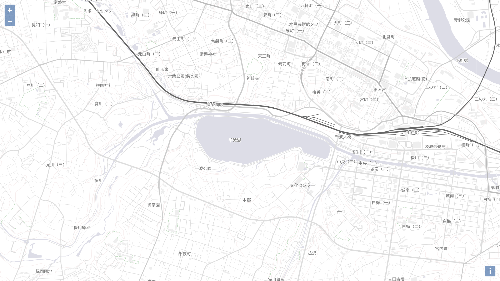
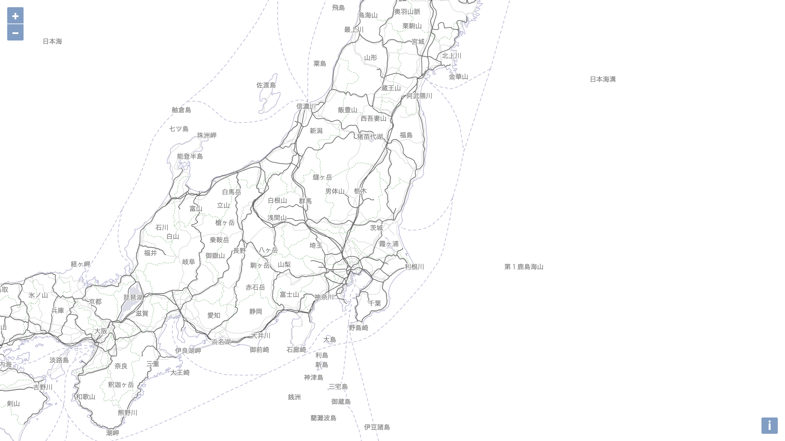
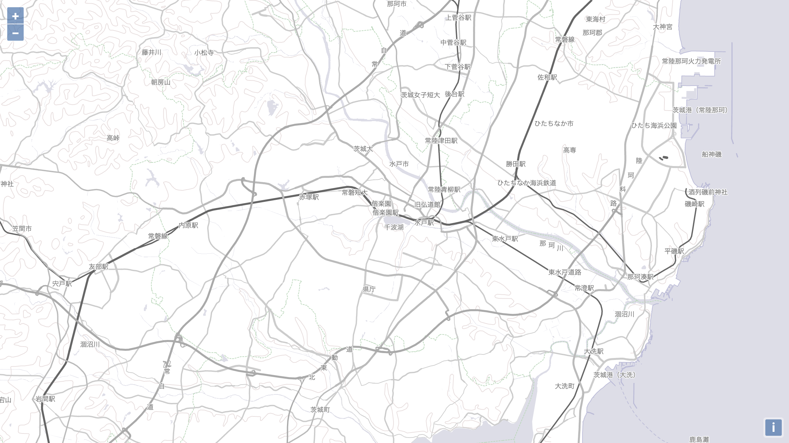

# 国土地理院ベクトルタイル + OpenLayers + TypeScript Example



[国土地理院が提供実験を開始したバイナリベクトルタイル](https://github.com/gsi-cyberjapan/gsimaps-vector-experiment "地理院地図Vector（仮称）提供実験のソース")を OpenLayers で表示したプロジェクトの作成例です。

地理院地図Vector（仮称）提供実験のソース  
https://github.com/gsi-cyberjapan/gsimaps-vector-experiment

## デモ

https://cieloazul310.github.io/figure/ol-vectortile-example3/

## 開発

```shell
$ git clone git@github.com:cieloazul310/ol-vectortile.git
$ yarn install
# develop
$ yarn run start
# build
$ yarn run build
# format with prettier
$ yarn run format
```

## ギャラリー




